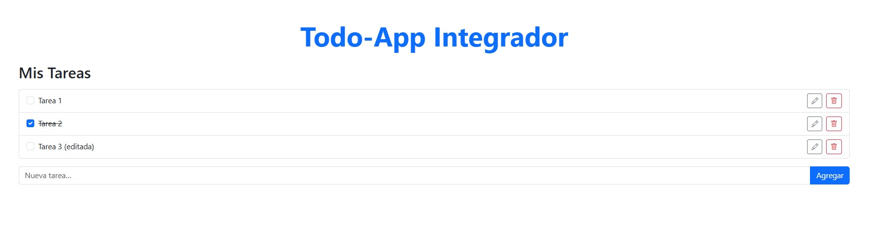
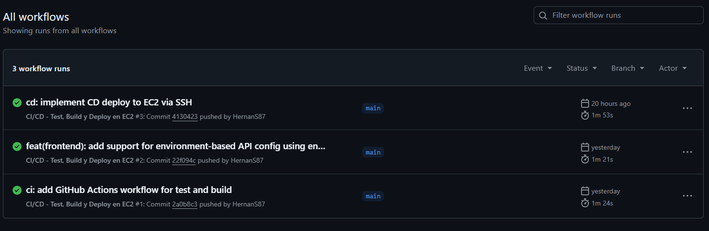
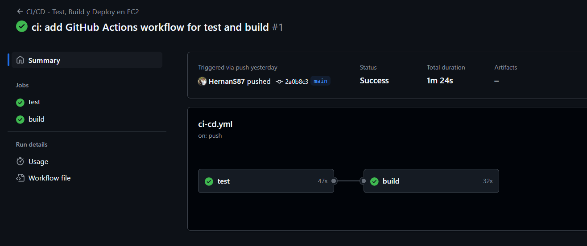
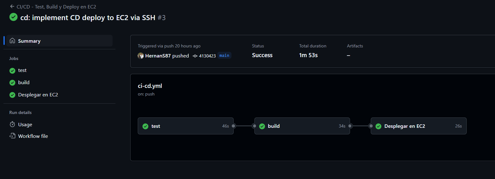

# Todo-App Integrador DevOps

## 📚 Descripción del proyecto

Aplicación web simple de tareas (Todo-App) desarrollada con una arquitectura **fullstack**, como parte de un trabajo integrador de la materia DevOps. Permite:

* Agregar, editar, marcar como completadas y eliminar tareas.
* Persistencia de datos en una base MySQL.
* Despliegue automatizado en servidor EC2 con Docker y GitHub Actions.

---

## 🧱 Tecnologías utilizadas

* **Frontend**: Angular 20 + Bootstrap 5
* **Backend**: Node.js + Express
* **Testing**: Jest + Supertest (backend)
* **Base de datos**: MySQL 8
* **Docker**: Contenedorización con Dockerfile y Docker Compose
* **CI/CD**: GitHub Actions + deploy automático en EC2
* **GitHub Secrets**: para credenciales seguras en el deploy
* **Infraestructura**: AWS EC2 (Ubuntu 22.04)

---

## 🦜 Instrucciones para correr localmente con Docker

### 1. Clonar el repositorio

```bash
git clone https://github.com/HernanS87/todo-app-integrador-devops.git
cd todo-app-integrador-devops
```

### 2. Descargar las imágenes

```bash
docker-compose pull
```

### 3. Levantar los contenedores

```bash
docker-compose up -d
```

### 4. Acceder a la app

* Frontend: [http://localhost:4200](http://localhost:4200)
* Backend (API): [http://localhost:3000/api/tasks](http://localhost:3000/api/tasks)
* MySQL: puerto `3310`, base `appdb`, usuario `root`, password `MiPass123`

### 5. Base de datos

Se inicializa automáticamente con el script `db-init/init.sql`

---

## 🚜 Pipeline DevOps (CI/CD)

El pipeline se ejecuta al hacer `push` o `pull_request` a `main`:

### Etapas:

1. **Test**: corre Jest + Supertest sobre el backend.
2. **Build**: construye las imágenes Docker del frontend y backend, y las sube a Docker Hub.
4. **Deploy**: accede por SSH a EC2 y ejecuta `git pull` y `docker-compose up -d`.

El deploy utiliza `docker-compose.override.yml` y `env.prod.js` para inyectar la URL correcta al frontend.

---

## 🌐 App en línea (EC2)

La aplicación está desplegada en una instancia EC2 pública.  
Podés acceder desde el siguiente enlace:

🔗 [http://18.223.205.8:4200](http://18.223.205.8:4200)

---

## 🎓 Roles del equipo

Aunque trabajamos en conjunto para aprender DevOps, estos son los roles oficiales:

* **Valeria Ana (Frontend)**: Angular y estilos
* **Isabella (Frontend)**: Servicios y consumo de API REST
* **Emiliano (Backend)**: Rutas y lógica con Express
* **Yesica (QA Tester)**: Tests de integración con Jest + Supertest
* **Hernán (DevOps)**: Docker, CI/CD y despliegue en AWS EC2

---

## 📊 Conclusiones

* Se logró un pipeline funcional con tests, build y deploy automatizado.
* La app es portable y se puede correr localmente o en la nube.
* Se aprendió a integrar herramientas clave de DevOps: Docker, GitHub Actions, AWS y buenas prácticas de trabajo en equipo.

---

## 📄 Capturas de ejecución




